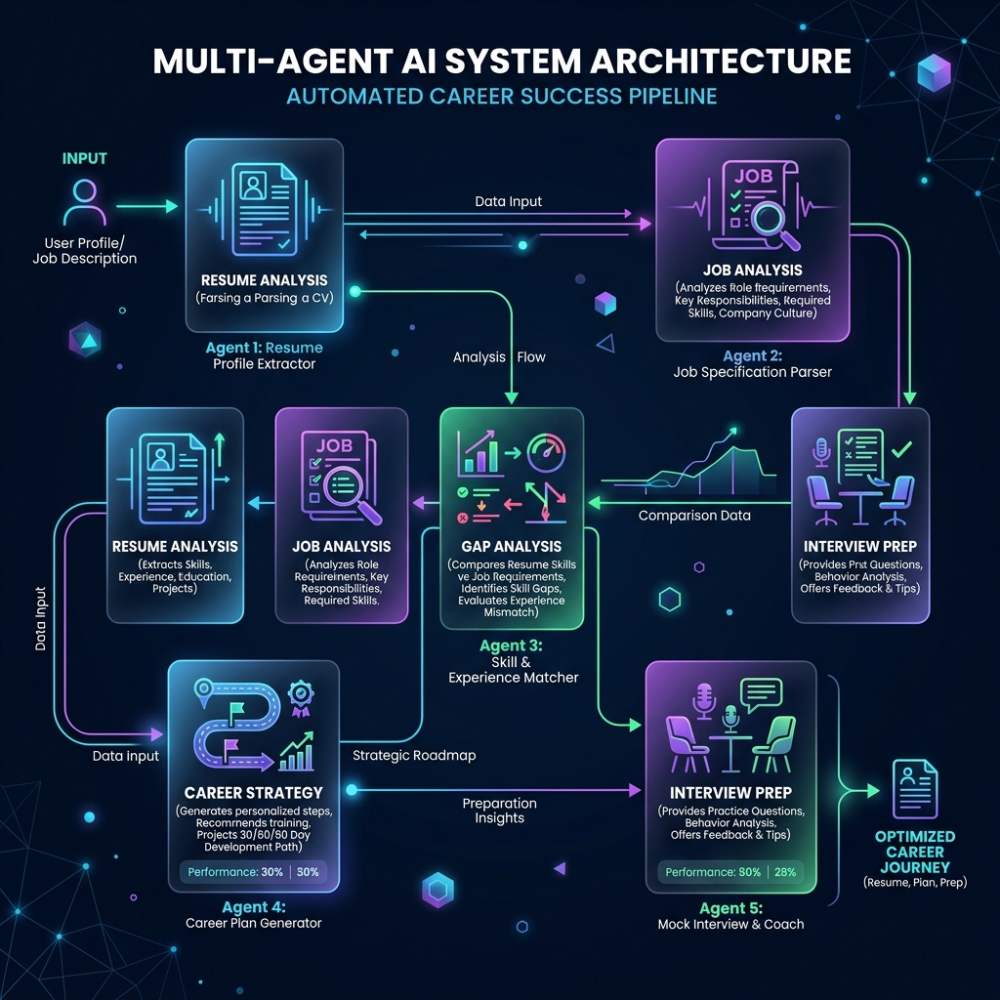
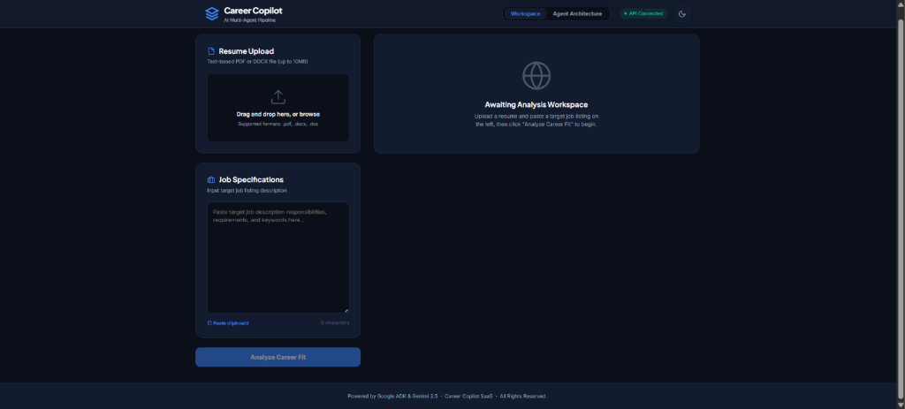
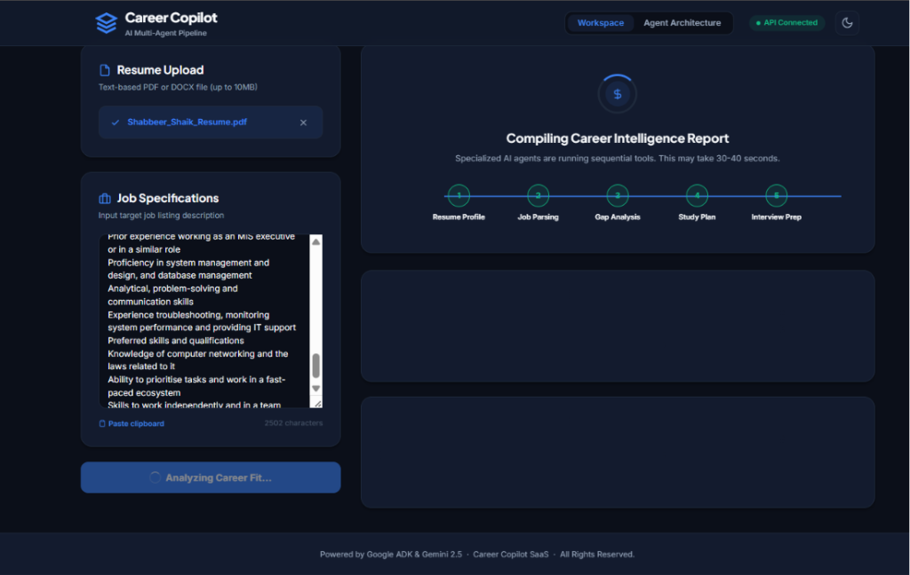
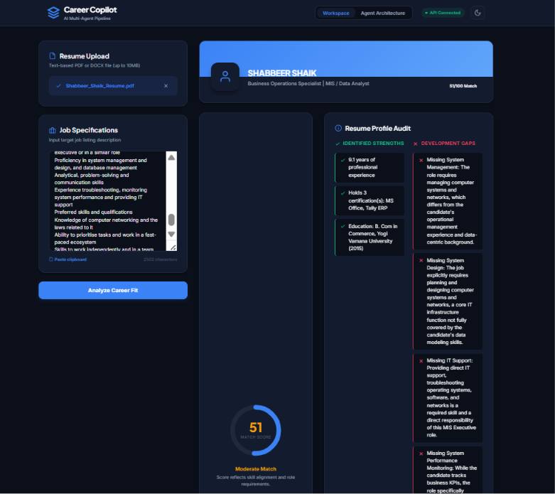

# Career Copilot

> A production-ready, multi-agent AI system built with [Google ADK](https://google.github.io/adk-docs) and Google Gemini that analyzes resumes, deconstructs job descriptions, identifies skill gaps, constructs tailored 30/60/90-day learning roadmaps, and prepares candidates for interviews.

---

## Problem Statement

When applying for modern jobs, candidates face a highly competitive landscape that requires tailoring resumes to match complex job descriptions. Identifying key skill gaps, finding relevant learning resources, creating action-oriented study roadmaps, and anticipating specific interview questions is a manual, tedious, and error-prone process. Job seekers struggle to perform this deep analysis effectively for every application, leading to lower conversion rates and unprepared interviews.

---

## Solution Overview

**Career Copilot** solves this problem by automating the end-to-end career analysis pipeline. Using a sequence of specialized AI agents built on the Google Agent Development Kit (ADK), the application extracts candidate profiles, analyzes target role requirements, scores skill alignment, and synthesizes a complete **Career Intelligence Report**. 

Candidates can interact with Career Copilot via a robust **Interactive CLI** or a modern, responsive **Web Dashboard** which supports uploading PDF/DOCX resumes and inputting target job descriptions.

---

## Architecture Diagram

Below is the system architecture showing how the pipeline components connect and how the root **CareerCopilotCoordinator** orchestrates the specialist sub-agents:



### Project Structure

```
career_copilot/
│
├── agents/                  # Specialist agent definitions (ADK LlmAgent/SequentialAgent)
│   ├── __init__.py          # Exports all specialist agent instances
│   ├── coordinator.py       # Root sequential orchestrator (7-step pipeline)
│   ├── resume_agent.py      # Extracts candidate profiles from resume text
│   ├── job_agent.py         # Deconstructs job description requirements
│   ├── gap_agent.py         # Compares resume against job to compute skill gaps
│   ├── strategy_agent.py    # Generates 30/60/90-day action plans
│   └── interview_agent.py   # Creates tailored interview preparation kits
│
├── api/                     # FastAPI backend
│   ├── __init__.py
│   └── server.py            # Serves API endpoints and static frontend UI
│
├── coordinator_agent/       # Entry point package for ADK Dev Server
│   └── __init__.py          # Exposes root_agent for 'adk web' / 'adk run'
│
├── docs/                    # Documentation and assets
│   └── assets/
│       └── career_copilot_architecture.png  # System architecture diagram
│
├── frontend/                # Web Dashboard static client files
│   ├── app.js               # UI logic and API client
│   ├── index.html           # Main dashboard layout
│   └── style.css            # Custom CSS styling with premium dark mode
│
├── mcp_server/              # Model Context Protocol (MCP) server
│   ├── __init__.py
│   └── server.py            # FastMCP server exposing document parsing tools
│
├── prompts/                 # Centralized system instructions/prompts
│   ├── __init__.py
│   ├── coordinator_prompts.py
│   ├── document_processor_prompts.py
│   ├── gap_prompts.py
│   ├── interview_prompts.py
│   ├── job_prompts.py
│   ├── resume_prompts.py
│   └── strategy_prompts.py
│
├── tools/                   # Specialist helper tools called by agents
│   ├── __init__.py          # Wraps functions as FunctionTools
│   ├── gap_tools.py
│   ├── interview_tools.py
│   ├── job_tools.py
│   ├── pdf_parser.py        # PDF text extractor utility
│   ├── resume_tools.py
│   └── strategy_tools.py
│
├── .env.example             # Configuration template
├── Dockerfile               # Production container build definition
├── main.py                  # Interactive CLI entry point
├── requirements.txt         # Package dependencies
└── README.md                # Project documentation
```

---

## Agent Workflow

Career Copilot utilizes a `SequentialAgent` pipeline (consisting of 7 steps) to run specialist agents in an optimized sequence, sharing analysis state through the ADK session context:

1. **`DocumentProcessorAgent` (Step 0)**: Connects to a local MCP (Model Context Protocol) server via stdio to extract raw text from PDF resume files and parse it into canonical resume sections.
2. **`ResumeAnalysisAgent` (Step 1)**: Accepts raw resume text and extracts a structured JSON candidate profile containing candidate name, current title, years of experience, technical skills, soft skills, education, and certifications.
3. **`JobAnalysisAgent` (Step 2)**: Analyzes target job descriptions, extracting key responsibilities, required skills, preferred qualifications, and company culture elements.
4. **`GapAnalysisAgent` (Step 3)**: Compares the candidate profile (Step 1) against job requirements (Step 2) to compute a match score, list missing technical skills/keywords, and outline high, medium, and low-priority gaps.
5. **`CareerStrategyAgent` (Step 4)**: Generates a step-by-step 30/60/90-day career roadmap, detailing specific action items, recommended learning resources, and hands-on side projects to close identified skill gaps.
6. **`InterviewPrepAgent` (Step 5)**: Produces a tailored interview kit featuring custom technical, behavioral, and system design questions mapped specifically to the candidate and the target job description.
7. **`CareerCopilotSynthesizer` (Step 6)**: Synthesizes all specialist agent outputs into a unified, client-ready **Career Intelligence Report**.

---

## Technologies Used

- **AI Orchestration**: [Google ADK (Agent Development Kit)](https://google.github.io/adk-docs)
- **Large Language Models**: Google Gemini API (`gemini-2.5-flash`)
- **Web Application**: FastAPI (Python backend), Vanilla HTML5/CSS3/JavaScript (Modern frontend dashboard)
- **Document Parsing**: PyMuPDF (`fitz`), `python-docx`
- **Tool Protocol**: Model Context Protocol (MCP) via `FastMCP`
- **Deployment & Containerization**: Docker, Google Cloud Run

---

## Installation

### Prerequisites
- Python 3.10+
- Git

### 1. Clone the Repository
```bash
git clone https://github.com/MrNasrulla15/Career-Copilot-AI-Agent.git
cd Career-Copilot-AI-Agent
```

### 2. Create and Activate Virtual Environment
```bash
python -m venv .venv

# Windows (Command Prompt / PowerShell)
.venv\Scripts\activate

# macOS / Linux
source .venv/bin/activate
```

### 3. Install Dependencies
```bash
pip install -r requirements.txt
```

---

## Local Setup

### 1. Configure Environment Variables
Copy the example environment file:
```bash
cp .env.example .env
```

### 2. Add API Keys & Settings
Open `.env` in your text editor and specify your Gemini credentials:
```env
GOOGLE_API_KEY=your_gemini_api_key_here
MODEL_NAME=gemini-2.5-flash
```
> Get a free API Key at [Google AI Studio](https://aistudio.google.com/app/apikey).

---

## Running the Project

### Interactive CLI Loop
Run the command-line interface to interact with the pipeline directly from the terminal:
```bash
python main.py
```
Pasting multi-line text (e.g. resumes/job descriptions) is fully supported. Type `DONE` on a new line and press Enter to submit your inputs.

### FastAPI + Web Dashboard
Launch the web interface locally:
```bash
uvicorn api.server:app --port 8000
```
Open **http://localhost:8000** in your browser. Here you can upload `.pdf` or `.docx` resume files, paste job descriptions, and view a visual dashboard containing the matched score, roadmaps, and interview questions.

---

## MCP Integration

The `DocumentProcessorAgent` utilizes the **Model Context Protocol (MCP)** to isolate and offload parsing routines.
- The MCP server is located at `mcp_server/server.py` and built using `FastMCP`.
- It exposes two tools:
  - `extract_resume_text(file_path: str)`: Extracts layout-aware raw text from a PDF resume.
  - `parse_resume_sections(text: str)`: Classifies and segments plain text into structured blocks (summary, experience, education, skills, etc.) using regex heuristic classifiers.
- The coordinator agent launches this server as a subprocess via ADK's `McpToolset` over `stdio` transport.

---

## Deployment

### Docker Containerization
A production [Dockerfile](file:///c:/Users/nasru/career-copilot/Dockerfile) is included at the root of the project. Build the image locally using:
```bash
docker build -t career-copilot .
docker run -p 8000:8000 --env-file .env career-copilot
```

### Deploy to Google Cloud Run
Deploy the application to Google Cloud Run:
```bash
gcloud run deploy career-copilot --source .
```
*Note: Make sure your target Google Cloud Project has an active billing account linked to enable Artifact Registry, Cloud Build, and containerized deployment capabilities.*

---

## Screenshots

*Interactive Web Dashboard - Upload & Input Page:*


*Interactive Web Dashboard - Pipeline Processing & Loading Page:*


*Interactive Web Dashboard - Career Intelligence Report & Match Score Page:*


---

## Future Improvements

1. **Persistent Session Databases**: Connect ADK session storage to Google Cloud Firestore or PostgreSQL to save history and track candidate progress over time.
2. **Mock Interview Audio Coach**: Integrate Gemini Live API (WebSockets) to offer speech-to-text interactive mock interview practice.
3. **Job Search API Integrations**: Directly fetch and load job descriptions from platforms like LinkedIn or Indeed using search URLs.
4. **Resubmit / Iteration Loop**: Enable users to edit their resume draft directly inside the web UI and immediately re-evaluate their matching score.
